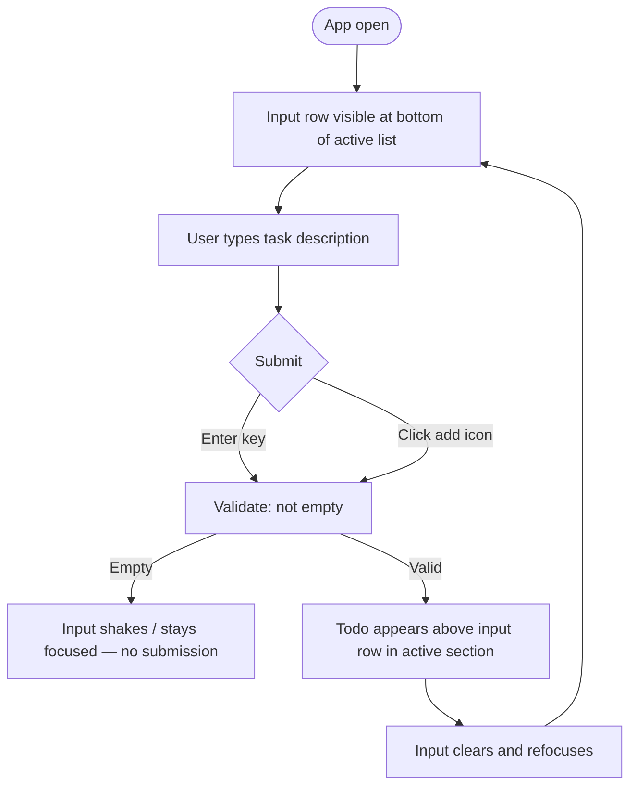
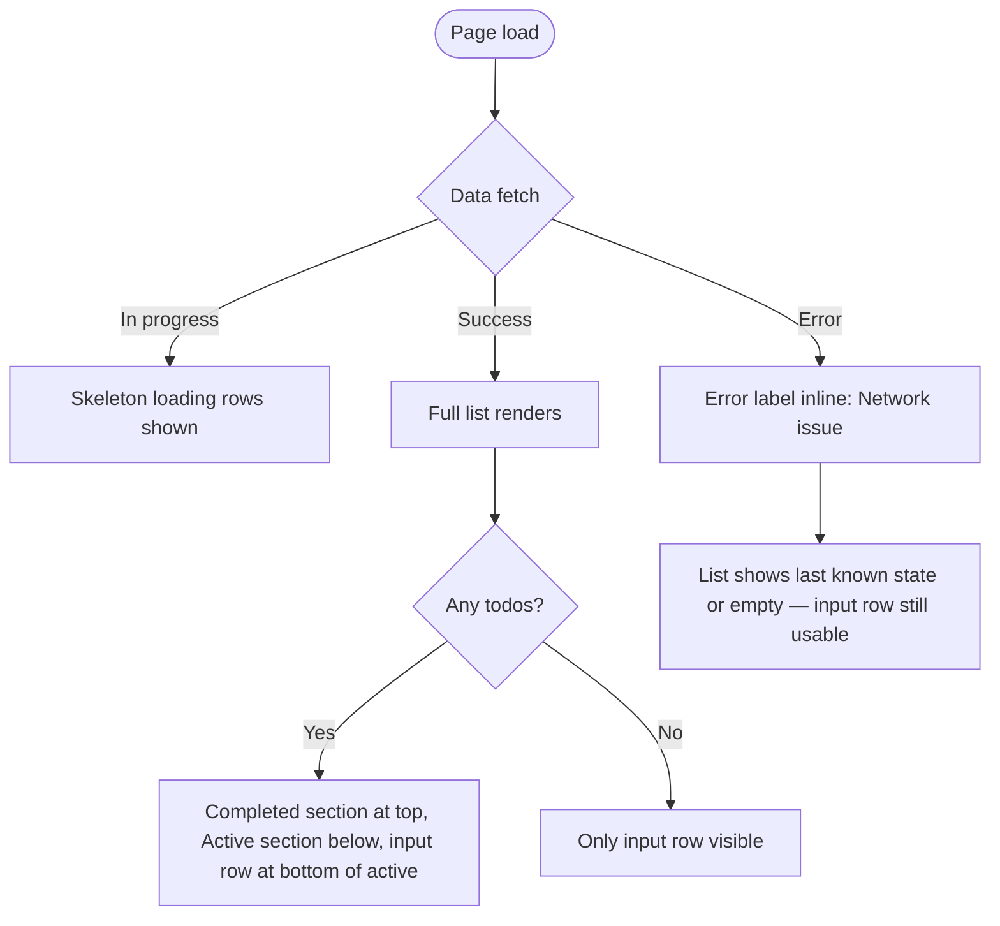
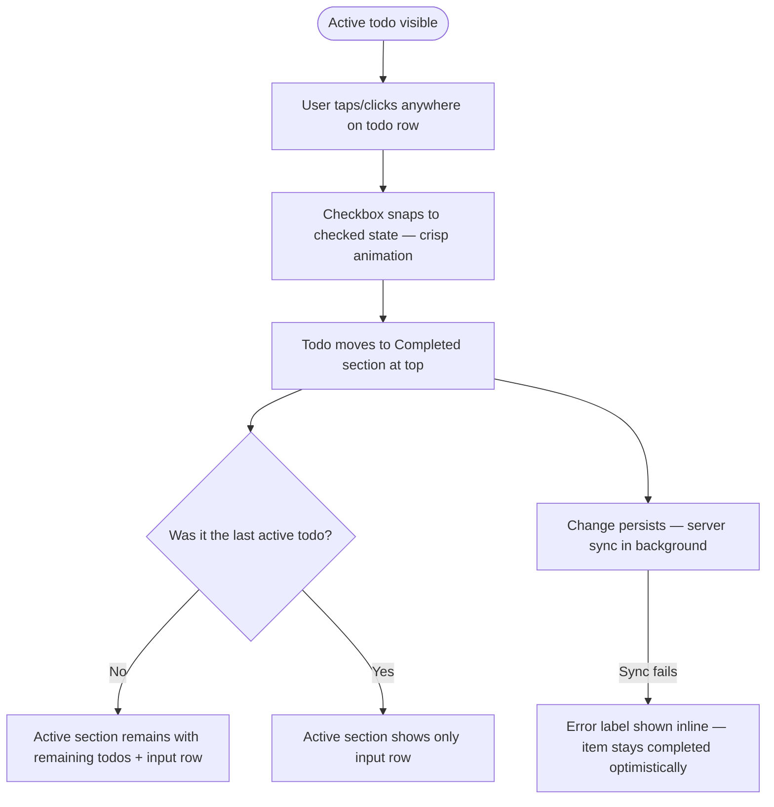
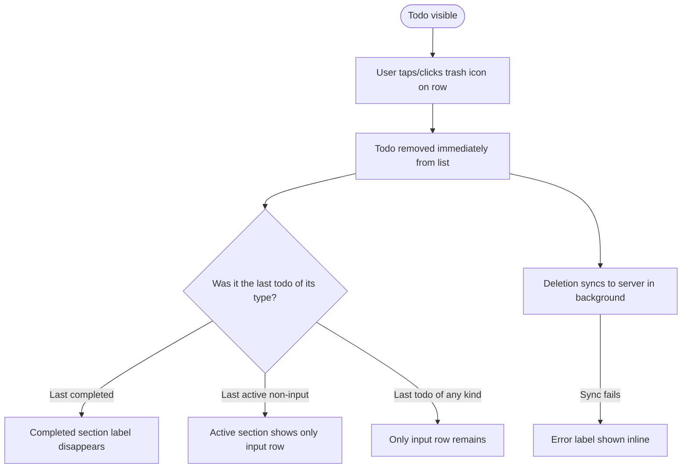
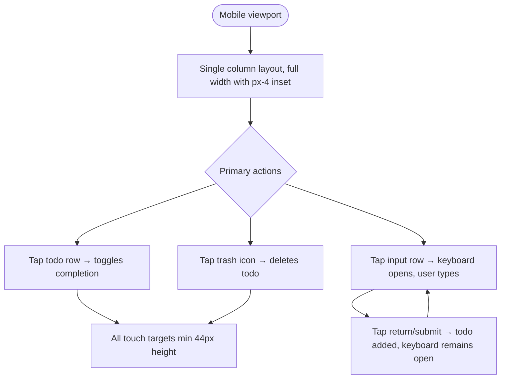

# UX Design Specification - todo-bmad

**Author:** Daan
**Date:** 2026-03-05

---

<!-- UX design content will be appended sequentially through collaborative workflow steps -->

## Executive Summary

### Project Vision

todo-bmad is a deliberately minimal full-stack Todo application built for instant, zero-onboarding task management. No accounts, no collaboration, no configuration — users open the app and interact immediately. The product delivers a complete, polished core experience as a foundation for potential future extension (authentication, multi-user support).

### Target Users

Individual users managing personal tasks across both desktop and mobile devices. No specific tech-savviness assumption — the zero-onboarding requirement mandates that all interactions must be self-evident to any user on any device.

### Key Design Challenges

- **Empty state clarity**: The first-run experience with an empty list must communicate the next action without instructions or tooltips
- **Visual completion feedback**: Active vs. completed state distinction must be immediately legible and feel rewarding (toggle interaction quality matters)
- **Mobile touch ergonomics**: Complete and delete actions must have sufficient tap targets at 375px without accidental triggers — especially with both actions potentially close together per row
- **Error states without disruption**: Errors must surface clearly without crashing or blocking the core flow

### Design Opportunities

- **Focused, calm UI**: With no auth, settings, or navigation, the entire interface can be devoted to the task list — an opportunity for an unusually clean, distraction-free experience
- **Snappy interaction feel**: Optimistic UI updates (immediate list changes on create/complete/delete) create a fast, satisfying feedback loop
- **Light/dark mode**: Supporting both modes with system-default detection and a manual toggle elevates the product feel significantly while keeping scope contained
- **Micro-interactions**: Subtle animations on add, complete, and delete can make a simple app feel polished and intentional

## Core User Experience

### Defining Experience

The heart of todo-bmad is a simple, satisfying loop: add a task, see it appear instantly, check it off when done. Everything in the interface serves this loop. The experience is defined by immediacy — no friction between intent and action.

### Platform Strategy

- **Platform**: Responsive web application, desktop and mobile (375px+ viewport)
- **Input modes**: Both keyboard (Enter to submit) and pointer/touch (tap add icon) are first-class citizens
- **Submit affordance**: Small, right-aligned add icon button — mirrors the position of the delete icon on existing rows
- **No offline requirement for v1**: Standard network-connected usage assumed

### Effortless Interactions

- **Adding a todo**: Type in the bottom input field, press Enter or tap the right-aligned add icon — no mode changes, no confirmation dialogs
- **Completing a todo**: Single tap/click on a checkbox or the todo item row toggles complete/active state instantly
- **Deleting a todo**: Always-visible right-aligned trash icon per row — positionally consistent with the add icon on the input row
- **Visual alignment**: Todo text and input text share the same left column; action icons (add/delete) share the same right column — creating a coherent, grid-like layout
- **List appears immediately**: Optimistic UI — list updates without waiting for server confirmation

### Critical Success Moments

- **First add**: User types their first todo and it appears instantly at the bottom of the active list — the app is immediately useful
- **Empty state → first item**: The transition from empty state to first todo must feel rewarding, not just functional
- **Completion toggle**: Marking a todo complete and seeing it move to the completed section should feel satisfying and final
- **Page reload persistence**: Returning to find all todos intact confirms the app can be trusted

### Experience Principles

1. **Immediacy over confirmation**: Every action reflects in the UI instantly — no spinners for primary interactions
2. **Bottom-anchored flow**: Input lives at the bottom; completed todos sit at top, active todos below them — natural reading and working direction
3. **Explicit over gestural on mobile**: No hidden swipe gestures — all actions visible and tappable at all times
4. **Structural consistency**: Input row and todo rows share the same visual grid — left column for text, right column for actions
5. **Calm focus**: The UI exists to serve the list — no visual noise, no chrome beyond what's needed

## Desired Emotional Response

### Primary Emotional Goals

**Primary:** Accomplishment — users feel they got things done. The app is a silent productivity partner; it takes credit for nothing and gets out of the way completely.

**Supporting feelings:**
- Control — the list is always current, always trustworthy
- Clarity — no clutter, no decisions to make beyond the tasks themselves

**Emotions to avoid:**
- Anxiety — no aggressive error messages, no dramatic states
- Confusion — every state (empty, loading, error) must be immediately interpretable
- Dependence — the app has no personality to form attachment to; it is a tool

### Emotional Journey Mapping

| Stage | Desired Feeling |
|---|---|
| First open (empty state) | Calm readiness — a blank slate inviting action |
| Adding first todo | Confidence — it works exactly as expected |
| Completing a todo | Accomplishment — definitive, satisfying |
| Viewing completed todos | Quiet pride — visible record of done work |
| Encountering an error | Informed, not alarmed — brief, actionable message |
| Returning after a break | Trust — everything is exactly as left |

### Micro-Emotions

- **Completion toggle**: Satisfying and crisp — a decisive click feel, supported by a checkbox animation (e.g. a clean checkmark draw or snap). Not soft or floaty — definitive.
- **Add action**: Immediate and rewarding — the todo appears without delay, input clears cleanly
- **Delete action**: Quiet removal — todo disappears without drama; no confirmation required
- **Error appearance**: Matter-of-fact — short label (e.g. "Network issue"), no panic, no walls of text

### Design Implications

- **Accomplishment** → Completed todos remain visible and are given prominent placement (top of list) — the user can see what they've achieved
- **Neutral/silent tool** → No personality copy, no congratulatory messages, no onboarding tooltips — the UI speaks through structure alone
- **Minimal but actionable errors** → Error messages are short labels (2–4 words), paired only with enough context to act (e.g. "Network issue" implies check connectivity — no further explanation needed)
- **Satisfying completion** → Checkbox animation on toggle: crisp, snappy, not decorative — reinforces the click feel without drawing attention to itself

### Emotional Design Principles

1. **Silent tool**: The app has no voice, no personality, no copy beyond labels and states — it recedes completely
2. **Accomplishment is visible**: Completed todos stay in view at the top — the record of done work is a feature, not clutter
3. **Errors inform, not alarm**: Brief, actionable labels only — trust the user to know what "Network issue" means
4. **Decisive interactions**: Animations and feedback are crisp and immediate — nothing soft or ambiguous

## Visual Design Foundation

### Color System

**Direction: Pure Neutral**

No accent color — the interface is distinguished entirely through shape, weight, contrast, and spacing. Interactive elements communicate affordance through form, not color.

**Light mode:**
- Background: `#FFFFFF` or near-white (`#FAFAFA`)
- Surface (input, subtle separators): `#F4F4F5`
- Primary text: `#09090B` (near-black)
- Secondary text (timestamps, placeholders): `#71717A`
- Completed todo text: `#A1A1AA` (dimmed)
- Border/divider: `#E4E4E7`
- Destructive (trash icon hover): `#EF4444` — the only non-neutral color, used only on destructive hover state

**Dark mode (mirrors structure, inverts contrast):**
- Background: `#09090B`
- Surface: `#18181B`
- Primary text: `#FAFAFA`
- Secondary text: `#71717A`
- Completed todo text: `#52525B`
- Border/divider: `#27272A`
- Destructive hover: `#EF4444`

**Mode switching:** System preference (`prefers-color-scheme`) as default; manual toggle persisted to `localStorage`. shadcn/ui CSS custom properties handle token swapping — no runtime JS theming needed.

**Accessibility:** All text/background combinations target WCAG AA contrast ratio (4.5:1 minimum for body text).

### Typography System

**Font stack:** System font stack — `-apple-system, BlinkMacSystemFont, 'Segoe UI', Roboto, sans-serif`

Renders natively on every OS with zero web font loading. Aligns with the Notion/Notes aesthetic — familiar, neutral, invisible.

**Type scale (Tailwind defaults, adjusted):**

| Role | Size | Weight | Notes |
|---|---|---|---|
| Todo text | `text-sm` (14px) | `font-normal` | Primary reading size |
| Completed todo | `text-sm` (14px) | `font-normal` | + `line-through`, dimmed color |
| Timestamp | `text-xs` (12px) | `font-normal` | Secondary color |
| Input placeholder | `text-sm` (14px) | `font-normal` | Muted color |
| Section label (Completed/Active) | `text-xs` (12px) | `font-medium` | Uppercase tracking |

No decorative fonts, no display sizes — this is a utility interface.

### Spacing & Layout Foundation

**Base unit:** 4px (Tailwind default). All spacing in multiples of 4.

**Layout:**
- Single-column, full-width up to a max-width cap (`max-w-2xl`, ~672px) centered on desktop
- No horizontal padding waste on mobile — content extends to comfortable inset (`px-4`)
- On desktop, the constrained width keeps the list readable without line lengths growing unwieldy

**Row spacing (airy):**
- Todo row padding: `py-3` (12px top/bottom) — comfortable touch target (minimum 44px effective height with text)
- Section gap between completed and active: `gap-4` or a subtle divider line
- Input row: `py-3` to match todo rows — visual consistency in the grid

**Vertical rhythm:**
- List fills available viewport height between any top chrome (title/toggle) and the fixed bottom input
- Input row is pinned to the bottom (`sticky bottom-0`) so it's always reachable without scrolling

### Accessibility Considerations

- All interactive elements meet minimum 44×44px touch target size (WCAG 2.5.5)
- Color is never the sole differentiator — completed todos use both color dimming AND strikethrough
- Checkbox uses Radix UI primitive — keyboard accessible, focus-visible ring, screen reader label
- Error messages are text, not color-only indicators
- Dark mode uses sufficient contrast on all token pairs
- Manual theme toggle is keyboard accessible and has a visible label

## UX Pattern Analysis & Inspiration

### Inspiring Products Analysis

**Notion**
- Content-first philosophy: the interface recedes, the content dominates
- Minimal chrome — controls appear contextually, never crowd the canvas
- Excellent light/dark mode implementation: both modes feel native, not afterthoughts
- Typography does the heavy lifting — hierarchy is communicated through weight and size, not decoration

**Slack**
- Clear information hierarchy without visual noise
- Status and error indicators are brief and matter-of-fact — inline, not modal
- Inline actions: destructive and contextual actions appear close to content, not in separate menus
- Dense but readable — a lot of content rendered without feeling cluttered

**Apple Notes (checkbox list)**
- Dead-simple toggle: tap once to check, tap again to uncheck — no modes, no friction
- Accessible across all devices with zero configuration
- No onboarding, no setup — open and use immediately
- The checkbox list pattern is instantly understood by all users

**Markdown file in code editor**
- Zero overhead to start — the tool is already open, no context switch required
- Plain text as the interface: what you type is what you get
- The simplicity is the feature — no chrome, no toolbars, just content

### Transferable UX Patterns

**Content-first layout** (from Notion, Slack)
- Todos are the entire UI — no sidebars, no navigation panels, no settings surfaces cluttering the view
- Controls appear where needed (inline per row), not in a separate toolbar

**Matter-of-fact status communication** (from Slack)
- Errors and loading states are inline, brief, non-modal — they inform without interrupting
- Directly applicable to error labels ("Network issue") and loading indicators

**Instant toggle** (from Apple Notes)
- Single tap/click to complete — no confirmation, no mode switch
- The checkbox is the affordance and the action in one

**Minimal-friction entry** (from markdown file workflow)
- The add input should feel as fast as typing a new line in a text file
- Enter to submit is the primary path — mirrors how a new markdown list item is created

### Anti-Patterns to Avoid

- **Feature-heavy chrome**: Toolbars, sidebars, settings panels, tags, filters — none of these belong in v1; they shift focus away from the list
- **Onboarding flows and tooltips**: The markdown file needed no tutorial; neither should this app
- **Modal confirmations**: Deleting a markdown line needs no confirmation dialog — neither should deleting a todo
- **Personality-driven empty states**: Cute illustrations or motivational copy are the opposite of "silent tool" — the empty state should simply invite the first entry

### Design Inspiration Strategy

**Adopt:**
- Content-first layout principle from Notion — the list *is* the UI
- Inline, brief status communication from Slack — no modals, no drama
- Single-tap toggle from Apple Notes — direct, immediate, no friction

**Adapt:**
- Notion's light/dark mode approach — apply the same "both modes feel native" quality, triggered by system preference with a manual toggle
- Markdown file immediacy — replicate the "type and it appears" feel with the bottom input + Enter flow

**Avoid:**
- Any pattern from feature-rich todo apps (Todoist, Things) that adds navigation, filtering, or organisational overhead
- Decorative empty states, onboarding overlays, or instructional tooltips
- Confirmation dialogs for destructive actions (delete is permanent and immediate, as in editing a markdown file)

## Design System Foundation

### Design System Choice

**shadcn/ui + Tailwind CSS** on a **React + TypeScript** frontend.

### Rationale for Selection

- **Content-first alignment**: Tailwind applies no visual opinions — layout and spacing are explicit, not inherited from a component library's defaults
- **Ownership model**: shadcn/ui components are copied into the codebase, not imported from a package — full control, no overrides, no version lock-in
- **Dark mode**: Tailwind's `dark:` variant + CSS custom properties (shadcn/ui's default approach) gives native-feeling light/dark mode with system preference detection and manual toggle support
- **Accessible primitives**: Radix UI (underlying shadcn/ui) handles checkbox state, focus management, and keyboard interactions correctly out of the box
- **TypeScript-native**: Full type safety across components with no additional configuration
- **Minimal bundle**: Only the components actually used are included — no bloat from unused UI library code

### Implementation Approach

- Use shadcn/ui CLI to add only the components needed: `Checkbox`, `Input`, `Button` (icon variant)
- Tailwind for all layout, spacing, and typography — no additional CSS files
- CSS custom properties for theme tokens (light/dark mode switching)
- System preference detection via `prefers-color-scheme` media query, with a manual toggle persisted to `localStorage`

### Customization Strategy

- Override shadcn/ui design tokens (CSS variables) to achieve the clean, neutral aesthetic — avoid default grey tones if they conflict with desired visual direction
- Keep the component set minimal: no cards, no modals, no dropdowns — only what the todo list needs
- Typography: system font stack (matches Notion's native feel) or a clean sans-serif; no decorative fonts

## 2. Core User Experience

### 2.1 Defining Experience

> "Capture a task in seconds and watch it appear in your list instantly."

The defining interaction is the add-and-complete loop: type a task, press Enter, see it appear — then tap it done when finished. Like editing a markdown file, but with persistence, structure, and a proper interface. Everything else in the UI exists to support this loop.

### 2.2 User Mental Model

Users arrive with a simple, established mental model: a checkbox list. They've used Apple Notes, markdown files, or paper lists. The expected behaviour is entirely familiar — there is nothing to learn. The app's job is to honour that expectation exactly and add nothing unexpected.

**Current solutions users come from:**
- Apple Notes checkbox lists: simple, synced, no setup — but no dedicated UI, no timestamps, limited to the Notes ecosystem
- Markdown files: already in the workflow, zero friction — but no UI, no persistence across devices, no visual state

**What they want todo-bmad to be:** the markdown file, but with a proper UI and reliable persistence.

### 2.3 Success Criteria

- User types a task and it appears in the list without any page reload or visible loading
- Input clears and refocuses immediately after submit — ready for the next entry without any additional action
- Tapping a todo row toggles completion instantly with a satisfying checkbox animation
- Completed todo moves to the top section; active todos remain below — no ambiguity about state
- On return visit, the list is exactly as left — nothing lost, nothing reordered unexpectedly

### 2.4 Novel vs. Established Patterns

**Verdict: Established patterns throughout — intentionally.**

The checkbox list is one of the most universally understood UI patterns. There is no novel interaction design in todo-bmad, and that is a deliberate strength. Innovation happens in execution quality (speed, animation, layout consistency) not in interaction paradigm. Users should never need to discover how anything works.

### 2.5 Experience Mechanics

**Add a todo:**
1. *Initiation*: Input field permanently visible at page bottom; placeholder "Add a task…" invites entry
2. *Interaction*: User types; submits via Enter key or right-aligned add icon button
3. *Feedback*: Todo appears immediately at bottom of active section; input clears and refocuses
4. *Completion*: The list update is the confirmation — no toast, no modal, no success message

**Complete a todo:**
1. *Initiation*: Every todo row is a tap/click target; checkbox on the left provides the visual affordance
2. *Interaction*: Tap anywhere on the row (desktop: click anywhere on the row)
3. *Feedback*: Crisp checkbox animation (checkmark draw/snap); todo moves to completed section at top
4. *Completion*: Item is visually distinct in completed section (strikethrough + dimmed); reversible with one tap

**Delete a todo:**
1. *Initiation*: Trash icon always visible, right-aligned on every row
2. *Interaction*: Tap/click trash icon
3. *Feedback*: Todo disappears immediately from list
4. *Completion*: Permanent removal — no confirmation, no undo; list reflows

## Design Direction Decision

### Design Directions Explored

Six primary directions explored across: bare/labeled section separation, inset card vs. flat layout, compact vs. airy density, square vs. round checkbox, header chrome options, and dark mode. Two additional directions explored edge case states (empty, error/loading).

### Chosen Direction

**Base:** Direction 2 (Labeled Sections) adapted with the following decisions:

- **Sections**: Explicit "Completed" / "Active" labels — clearer than a divider-only approach
- **Header**: "My Tasks" title + bare icon theme toggle (18px, no border/outline) — title provides visual anchor; toggle is clean without decorative chrome
- **Checkbox**: Round — consistent with the system/OS feel of the design
- **Input placement**: Inline within the list — the input row is the last item in the active section (or the only item when no todos exist). No special empty state: the list always renders with the input row present, no "no tasks yet" message. A faded placeholder checkbox (opacity 0.4) renders to the left of the input for full visual parity with existing todo rows.
- **No divider** between input row and existing todos — the input is part of the list, not separated from it
- **Input row height**: `min-height` matching a standard todo row (text + timestamp height) — checkbox aligns consistently with all other rows
- **Dark mode background**: `#18181B` (not `#09090B`) — less harsh, more readable
- **Dark mode secondary text**: `#71717A` for labels, timestamps, completed text — sufficient contrast while clearly subordinate
- **Theme toggle color**: `#71717A` light / `#A1A1AA` dark — legible in both modes

## User Journey Flows

### Journey 1: Create a Todo

**Entry**: User opens app — input row visible at bottom of active section

**UX notes:**
- Input always has focus on page load
- Add icon visible but muted when input is empty; active when input has content
- No success toast — the new item in the list is the confirmation

---

### Journey 2: View Todo List

**Entry**: App loads — list renders immediately from persisted state

**UX notes:**
- Loading state uses skeleton rows at same height as real rows — no layout shift on load
- Error does not block the UI — user can still type a new todo
- Timestamps visible per item in secondary color below todo text

---

### Journey 3: Complete a Todo

**Entry**: At least one active todo visible

**UX notes:**
- Row tap target is the entire row width — checkbox is the visual affordance, not the only hit target
- Animation is a checkmark draw/snap — crisp, not soft
- Optimistic update: completion is immediate, sync happens after

---

### Journey 4: Delete a Todo

**Entry**: Any todo visible (active or completed)

**UX notes:**
- No confirmation dialog — delete is immediate and permanent
- Trash icon always visible on all devices (not hover-only)
- Section label disappears when its last item is removed — no empty section headings

---

### Journey 5: Use App on Mobile

**Entry**: App opened on 375px+ viewport

**UX notes:**
- Input row at bottom of active section — keyboard-open state naturally pushes content up, keeping input near keyboard
- No horizontal scrolling at any viewport ≥ 375px
- Trash and checkbox on opposite sides of row — accidental simultaneous tap not possible

---

### Journey Patterns

**Optimistic update pattern**: All mutations (create, complete, delete) update the UI immediately without waiting for server confirmation. Errors surface inline after the fact without blocking the UI.

**No-empty-section pattern**: Section labels ("Completed", "Active") only render when their section has items. The input row is always present in the active section — it is the section's anchor even when empty.

**Inline error pattern**: Errors never block the UI or use modals. They appear as a brief label close to the affected area — never full-page.

### Flow Optimization Principles

1. **Zero-step value**: The list is visible and usable immediately on load — no landing screen, no setup, no navigation
2. **Input always reachable**: The input row is always in document flow, never hidden or requiring scroll-to-find on normal list lengths
3. **Reversible by default**: Toggle completion is one tap to undo — the only irreversible action (delete) requires a targeted tap on the trash icon
4. **Errors don't block**: Every error state leaves the UI in a usable condition — user can always attempt the next action

### Design Rationale

- **Inline input, no divider** reinforces that the input *is* a list item — adding a divider would re-introduce the "separate region" feel we deliberately rejected. The faded checkbox provides all the visual differentiation needed.
- **Consistent row height** via `min-height` ensures the checkbox column aligns perfectly whether a row has one line (input) or two lines (text + timestamp) — no visual jitter as todos are added
- **No empty state special case** keeps the implementation simple and the UX consistent — the experience on first load is identical to after deleting the last todo. No conditional rendering, no copy to write.
- **Bare toggle icon** removes the last piece of decorative chrome from the header — the icon alone at 18px communicates the action clearly in both modes
- **Labeled sections** provide unambiguous structure without filtering UI — users always know where they are in the list
- **Revised dark mode tokens** correct insufficient contrast on secondary text while preserving the neutral aesthetic

### Implementation Notes

- Input row: `[faded placeholder checkbox] [text input]` — no visible add button; Enter is the primary submit action
- On Enter/submit: input clears, new todo appears immediately above the input row in the active section
- Faded checkbox: `opacity: 0.4` on the border token — not interactive, purely positional
- Input row `min-height` set to match two-line todo row height to maintain column alignment
- Theme toggle: 18px icon, `color: #71717A` light / `#A1A1AA` dark, hover to primary text color

## Component Strategy

### Design System Components

From shadcn/ui (via Radix UI), used directly:

| Component | Usage |
|---|---|
| `Checkbox` | Todo completion toggle — handles state, keyboard navigation, focus ring, ARIA |
| `Input` | Text input within `TodoForm` |
| `Button` (`variant="ghost"`) | Trash icon button, add icon button, theme toggle |
| `Skeleton` | Loading state placeholder rows |

All shadcn/ui components accept Tailwind className overrides — no custom CSS files needed.

### Custom Components

**`TodoRow` — shared layout primitive**

Purpose: Owns all structural layout shared between `TodoItem` and `TodoForm`. Guarantees visual consistency at the component level rather than by convention.

- Anatomy: flex row, `min-height` matching two-line content height, `py-3 px-4`, `gap-3`, `items-center`
- Slots: `left` (checkbox area, fixed width), `content` (flex-1, overflow handling), `right` (optional icon action, fixed width)
- States: default, hover (background tint)
- No internal logic — pure layout shell

---

**`TodoItem` — composes `TodoRow`**

Purpose: Renders a single persisted todo with its full interactive state.

- Anatomy: `TodoRow` with `Checkbox` in left slot, text + timestamp stack in content slot, `Button` (trash icon) in right slot
- States: active (default), completed (strikethrough + dimmed text + checked checkbox), hover (row background tint + trash icon at full opacity)
- Accessibility: `aria-label` on checkbox ("Mark as complete"/"Mark as active"), `aria-label` on trash button ("Delete todo")
- Interaction: entire row is clickable for toggle; trash icon click stops propagation

---

**`TodoForm` — composes `TodoRow`**

Purpose: Inline todo creation row, visually indistinguishable in structure from `TodoItem`.

- Anatomy: `TodoRow` with faded placeholder checkbox (`opacity-40`, non-interactive) in left slot, `Input` in content slot, no right slot content
- States: empty (muted placeholder), focused (cursor in input field), has-value (add icon becomes active if shown)
- On submit (Enter): calls `onCreate`, clears input, returns focus to input
- Accessibility: `Input` has `aria-label="Add a task"`, placeholder "Add a task…"

---

**`TodoSection` — section container**

Purpose: Labeled group of todo rows, conditionally rendered.

- Anatomy: section label (`text-xs font-medium uppercase tracking-wide`) + list of `TodoItem`s
- Renders only when it has items — no empty section headings
- Props: `label`, `items`, `onToggle`, `onDelete`
- Note: `TodoForm` is rendered at the App level below the sections, not inside `TodoSection`

---

**`AppHeader`**

Purpose: Page title + theme toggle.

- Anatomy: flex row space-between, `h2` title, `Button` (ghost, icon-only) with sun/moon SVG (18px)
- Accessibility: `aria-label="Switch to dark mode"` / `"Switch to light mode"`

---

**`ErrorBanner`**

Purpose: Inline, non-blocking error communication.

- Anatomy: small flex row with warning icon + short text label (e.g. "Network issue")
- Auto-dismisses when error condition clears

---

**`ThemeProvider`**

Purpose: Theme state management — system preference detection + manual override + persistence.

- Reads `prefers-color-scheme` on mount, checks localStorage for override
- Applies `dark` class to `<html>` (Tailwind dark mode strategy)
- Exposes `theme` + `toggleTheme` via context

### Component Implementation Strategy

- `TodoRow` is the single source of truth for row layout — any spacing change propagates automatically to both `TodoItem` and `TodoForm`
- All components use Tailwind classes exclusively — no separate CSS files
- shadcn/ui CSS variable tokens used for all colors — light/dark switching is automatic
- Component tree: `ThemeProvider` → `AppHeader` + `TodoSection` (completed) + `TodoSection` (active) + `TodoForm`

### Implementation Roadmap

**Phase 1 — Core:**
`TodoRow` → `TodoForm` → `TodoItem` → `TodoSection`

**Phase 2 — Supporting:**
`AppHeader` + `ThemeProvider` → `ErrorBanner`

**Phase 3 — Polish:**
Skeleton loading rows · Checkbox animation · Row enter/exit transitions

## UX Consistency Patterns

### Interaction Feedback Patterns

| Action | Immediate feedback | Confirmation |
|---|---|---|
| Create todo | Todo appears above input row instantly; input clears and refocuses | The list update is the confirmation — no toast |
| Toggle complete | Checkbox snaps checked/unchecked (crisp animation); item moves to correct section | Visual position change is the confirmation |
| Delete todo | Item disappears immediately; list reflows | Absence from list is the confirmation |
| Theme toggle | Theme switches instantly | No confirmation needed |

**Rules:**
- All mutations are optimistic — UI updates before server confirms
- No success toasts, banners, or modals for any successful action
- The resulting list state is always the confirmation

### Form Patterns

**Input field (`TodoForm`):**
- Placeholder: "Add a task…" — disappears on focus
- Validation: empty input rejected silently (no submission, no error message — input stays focused)
- Max length: 500 characters (FR-01) — input stops accepting characters at limit; no error label needed
- Submission: Enter key (primary) — always works when input has content
- Post-submit: input clears and refocuses immediately — ready for next entry without user action
- Focus on load: input has focus on page load and after every successful submission

### Loading State Patterns

**Initial page load:**
- Skeleton rows render immediately while data fetches — same height as real todo rows to prevent layout shift
- Skeleton uses pulsing animation (`opacity` cycle) at muted background color
- Input row renders below skeletons — user can begin typing before list loads
- On data arrival: skeletons replaced with real rows, no visible jump

**Per-action loading:**
- No loading indicators for individual create/complete/delete — optimistic updates make them feel instant
- Loading state only at page-level initial fetch

### Error Patterns

**Error display:**
- Inline `ErrorBanner` below the header, above the list
- Short label only: "Network issue", "Failed to save" — no body copy
- Warning icon + text in error color (`#EF4444`) on tinted background
- Non-blocking: user can continue interacting while error is visible

**Error clearing:**
- Auto-dismisses when error condition resolves — no close button needed

**Optimistic rollback:**
- If a mutation fails server-side, surface the error banner but do not reverse UI state — defer to retry/reload strategy

### Empty State Patterns

**No todos at all:**
- Only `TodoForm` visible — no section labels, no placeholder text, no illustrations
- Input placeholder "Add a task…" is sufficient — no special empty state component needed

**No active todos (all completed):**
- Completed section renders normally at top
- Active section shows only `TodoForm` — no "Active" label (label only renders when items exist)

**No completed todos:**
- Completed section does not render at all — no label, no placeholder

### Navigation Patterns

Not applicable for v1 — single-page, single-view. No navigation needed.

### Modal and Overlay Patterns

Not applicable for v1 — no modals, dialogs, or overlays. Deletions are immediate and permanent.

## Responsive Design & Accessibility

### Responsive Strategy

**Approach: Mobile-first, single-column, max-width constrained**

The layout is a single column at all viewport sizes. No breakpoint triggers a layout change — the design is inherently responsive. The only adaptation is horizontal containment on desktop.

| Viewport | Behaviour |
|---|---|
| Mobile (375px+) | Full width, `px-4` inset, all touch targets ≥ 44px |
| Tablet (768px+) | Full width up to max-width cap, centered |
| Desktop (1024px+) | `max-w-2xl` (~672px) centered — list width stays readable |

No multi-column layouts, no sidebar, no navigation — the content is the entire viewport.

### Breakpoint Strategy

**Tailwind breakpoints used:**

- `sm` (640px) — not used; design works at 375px without modification
- `md` (768px) — optional: slightly increased horizontal padding
- `lg` (1024px) — `max-w-2xl mx-auto` activates to contain the list on large screens

**Mobile-first:** All base styles target mobile. `md:` and `lg:` prefixes only add the centered container — no other layout changes at any breakpoint.

### Accessibility Strategy

**Target: WCAG 2.1 Level AA**

**Color contrast:**
- Primary text on background: exceeds 7:1 (AAA) in both light and dark
- Secondary text (timestamps, labels): meets 4.5:1 (AA) — verified with revised dark mode tokens (`#71717A` on `#18181B`)
- Completed todo text: meets 3:1 (AA for UI components) — strikethrough + dimming together exceed the single-indicator rule

**Keyboard navigation:**
- Full keyboard operability — Tab through all interactive elements
- Enter submits the input (native behaviour); Space toggles checkbox (Radix UI)
- No keyboard traps anywhere in the UI
- Focus visible on all interactive elements (shadcn/ui provides focus rings by default)

**Screen reader support:**
- Semantic HTML: `<main>`, `<header>`, `<ul>`, `<li>` for list structure
- Checkbox: `aria-label` ("Mark as complete" / "Mark as active")
- Trash button: `aria-label="Delete todo"`
- Theme toggle: `aria-label` updates dynamically
- `ErrorBanner`: `role="alert"` for immediate screen reader announcement
- Timestamps: `<time dateTime="...">` element

**Touch targets:**
- All interactive elements meet minimum 44×44px (WCAG 2.5.5)
- `TodoRow` min-height ensures rows are always sufficient touch targets
- Trash icon and checkbox on opposite sides — no accidental co-activation

**Reduced motion:**
- Checkbox animation and row transitions respect `prefers-reduced-motion` — disabled when OS-level reduced motion is set

### Testing Strategy

**Responsive testing:**
- Chrome DevTools at 375px, 390px, 768px, 1280px
- Real device: iOS Safari (iPhone), Android Chrome
- Cross-browser: Chrome, Firefox, Safari latest stable (NFR-08/09)

**Accessibility testing:**
- Automated: axe-core or Lighthouse audit in CI
- Manual keyboard: full tab sequence, Enter/Space on all interactive elements
- Screen reader: VoiceOver (macOS/iOS) smoke test for critical flows
- Contrast: verified via browser DevTools contrast checker

### Implementation Guidelines

**Responsive:**
- `max-w-2xl mx-auto px-4` on root container — everything else naturally responsive
- No fixed pixel widths on any element except icons
- Test at 375px first — if it works there, it works everywhere larger

**Accessibility:**
- Use shadcn/ui (Radix UI) for all interactive components — accessibility built in
- Add `aria-label` to every icon-only button
- Use `role="alert"` on `ErrorBanner`
- Wrap all timestamps in `<time dateTime="...">`
- Wrap all CSS transitions in `prefers-reduced-motion` media query
